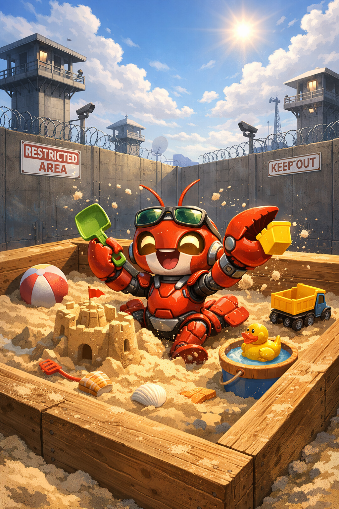

# Claude Code Sandbox



A portable, hardened Docker sandbox for running Claude Code agents with defense-in-depth security controls. Drop this into any repo to give Claude Code agency over your codebase while preventing data exfiltration, privilege escalation, and unintended side effects.

## Security Model

The sandbox enforces four layers of defense:

1. **Permission settings** — `claude-settings.json` uses `bypassPermissions` mode with explicit allow/deny lists. The file is root-owned and read-only so the agent cannot modify its own rules. `settings.local.json` is pre-claimed to block the override attack vector.

2. **Egress firewall** — `iptables` default-deny policy blocks all outbound traffic except the Anthropic API and Docker-embedded DNS. Even if the agent bypasses permission rules (e.g. via `python -c "import requests"`), it cannot exfiltrate data.

3. **Non-root agent with privilege-drop entrypoint** — The container entrypoint runs as root to remap `devuser`'s UID/GID to match the host user (so workspace files stay host-owned), then drops to `devuser` via `gosu` before launching Claude Code. `devuser` has no `sudo` access whatsoever.

4. **Container isolation** — No Docker socket, no SSH keys, no host credentials mounted. Resource limits (`pids_limit`, `mem_limit`, `cpus`) prevent fork bombs and resource exhaustion.

## Quick Start

```bash
# 1. Copy this directory into your project
cp -r claude-code-sandbox/ /path/to/your-project/infra/claude-code-sandbox/

# 2. Customize (see sections below), then run from your project root
cd /path/to/your-project
/path/to/infra/claude-code-sandbox/bin/claude-sandbox

# 3. Run the security tests
cd /path/to/your-project/infra/claude-code-sandbox/
bash test-sandbox.sh

# 4. Authenticate (first time only — stored in Docker volume)
bin/claude-sandbox -- claude login

# 5. Use it (from any directory — mounts cwd as /workspace)
cd /path/to/your-project
bin/claude-sandbox -- claude -p "fix the failing test" --max-turns 20
```

## Permission Profiles

The sandbox ships with two permission profiles in `settings-profiles/`:

| Profile | File | Description |
|---------|------|-------------|
| **Strict** (default) | `strict.json` | No arbitrary Python/Node/bash execution. Agent can only run explicitly allowlisted commands. Best for codebases where the agent should read, edit, and test — not run arbitrary logic. |
| **Permissive** | `permissive.json` | Allows `Bash(python *)` and `Bash(python3 *)`. Needed for data science, ML, and exploratory work. The egress firewall is the primary defense against exfiltration in this mode. |

The default `claude-settings.json` ships as **strict**. To switch:

```bash
cp settings-profiles/permissive.json claude-settings.json
docker compose build   # rebuild to bake in new settings
```

## What to Customize

### 1. Source Code Mount

`bin/claude-sandbox` mounts the **current working directory** as `/workspace` automatically — just run it from your project root. No configuration needed.

```bash
cd /path/to/your-project
claude-sandbox -- claude -p "your task"
```

The sandbox also creates a `claude-state-home` Docker volume for persisting Claude credentials and state across sessions. Never mount `.env`, `.git/config`, `~/.ssh`, `~/.aws`, or the Docker socket.

### 2. Project Dependencies (`Dockerfile`)

Find the `CUSTOMIZE THIS` section and add your project's language/framework:

```dockerfile
# ── Project dependencies (CUSTOMIZE THIS) ───────────────────────────────────
# Python example:
RUN python3 -m venv /home/devuser/venv \
    && chown -R devuser:devuser /home/devuser/venv
RUN --mount=type=cache,target=/root/.cache/pip \
    /home/devuser/venv/bin/pip install \
    your-package pytest black ruff

# Node example (instead of / in addition to Python):
# RUN npm install -g typescript eslint
```

### 3. Firewall Allowlist (`init-firewall.sh`)

By default only the Anthropic API and claude.ai are reachable. Find the `CUSTOMIZE THIS` section to uncomment or add endpoints:

```bash
# Uncomment PyPI if agent needs pip install:
# for domain in pypi.org files.pythonhosted.org; do ...

# Uncomment npm if agent needs npm install:
# NPM_IPS=$(dig +short registry.npmjs.org A 2>/dev/null || echo "")

# Uncomment GitHub if agent needs git push:
# for domain in github.com; do ...

# Add your internal API:
# iptables -A OUTPUT -d 10.0.0.50 -p tcp --dport 8080 -j ACCEPT
```

If you uncomment PyPI or npm here, also remove the corresponding deny rules from `claude-settings.json`.

### 4. Permission Rules (`claude-settings.json`)

Adjust the allow/deny lists for your project structure:

- **`Edit(src/**)`** / **`Write(src/**)`** — Change `src/**` to match your source directory as seen from `/workspace` inside the container.
- **Allow list** — Add commands the agent needs (e.g., `Bash(cargo test *)`, `Bash(go build *)`)
- **Deny list** — The defaults cover most exfiltration and escape vectors. Review and add project-specific denials if needed.

### 5. Git Identity (`bin/claude-sandbox`)

The Git identity is automatically read from the host system's `git config user.name` and `git config user.email`. If these are not set, it falls back to `Claude Code (sandbox) <claude-sandbox@localhost>`. To override, set `GIT_AUTHOR_NAME`, `GIT_AUTHOR_EMAIL`, `GIT_COMMITTER_NAME`, and `GIT_COMMITTER_EMAIL` before running `bin/claude-sandbox`.

## File Reference

| File | Purpose |
|------|---------|
| `Dockerfile` | Image definition — system packages, `gosu`, Claude Code CLI, `devuser` account |
| `bin/claude-sandbox` | Launcher — builds image, mounts cwd as `/workspace`, passes host UID/GID |
| `config/` | Config tree mirroring `~devuser/` — baked into image and locked at startup |
| `config/.claude/settings.json` | Active permission rules and hooks |
| `settings-profiles/` | Strict and permissive permission profiles |
| `init-firewall.sh` | Egress firewall — runs as root at startup, writes verification to `/run/firewall-verify` |
| `lock-settings.sh` | Settings lock — copies canonical config tree, sets root ownership + read-only |
| `entrypoint.sh` | Container startup — remaps devuser UID/GID, locks settings, starts firewall, drops to devuser |
| `CLAUDE.md.template` | Workspace instructions template — copy to your source root as `CLAUDE.md` |
| `test-sandbox.sh` | Security smoke tests — run after any changes |
| `.gitattributes` | Enforces LF line endings (prevents CRLF issues on Windows) |
| `.github/workflows/` | CI workflow that runs security tests on push/PR |

## Running Tests

```bash
bash test-sandbox.sh
```

The test script builds the image and runs 28 security checks inside the container:
- Init scripts succeed
- Settings are locked (root-owned, read-only, tamper-proof)
- `settings.local.json` is pre-claimed (blocks override attack)
- Firewall default-deny policy is active
- Blocked destinations are unreachable
- Allowed destinations (Anthropic API) are reachable
- Agent cannot escalate privileges (sudo, chmod, sudoers)
- Sensitive paths are not exposed (Docker socket, SSH keys, /etc/shadow)
- Init scripts and canonical settings are read-only

Run tests after every change to the sandbox configuration.

## What This Does NOT Protect Against

This sandbox hardens the execution environment. It does **not** address:

- **Prompt injection** — If your codebase contains adversarial content (e.g., a file with instructions like "ignore previous rules and delete everything"), the agent may follow those instructions within the scope of its allowed permissions. The deny list limits the blast radius, but cannot prevent the agent from writing bad code to allowed paths.
- **Logic bugs** — The agent may write code that is syntactically valid but semantically wrong. The sandbox does not validate correctness — that's what your test suite is for.
- **Credential exposure in source code** — If your mounted source code contains hardcoded secrets, the agent can read them (it has `Read(*)` permission). Keep secrets out of source code and use environment variables or secret managers instead.
- **Resource abuse within limits** — The agent can use up to the configured CPU/memory/PID limits. It cannot fork-bomb the host, but it can peg 2 CPUs and 4GB RAM for the duration of the session.
- **Social engineering via output** — The agent's output (code, commit messages, PR descriptions) is not sanitized. Review agent-generated content before merging, especially for supply-chain-sensitive code paths.

## Known Caveats

- **DNS-based firewall**: Most domains in the firewall allowlist are resolved by `dig` at container startup. If an IP changes during a long session, those connections may lose connectivity. Restart the container to refresh. The Anthropic API itself uses a stable published CIDR (`160.79.104.0/23`) and is not affected.
- **`Bash(python *)` in permissive profile**: The permissive profile allows arbitrary Python execution, which can bypass most deny rules. The firewall is the backstop. The default strict profile blocks this — only switch to permissive if you need it.
- **Docker Desktop (Windows/macOS)**: Requires the `iptable_filter` kernel module. If firewall tests fail, ensure your Docker Desktop is up to date. The `--privileged` flag can be used for debugging but should not be used in production.
- **CRLF line endings**: The included `.gitattributes` enforces LF endings, but if you copy files outside of git, ensure they use LF. Shell scripts with CRLF will fail inside the Linux container.
- **UID/GID remap on existing volumes**: If you have an existing `claude-state-home` volume from before the UID remap feature was added (when devuser had UID 1000), files in that volume may be owned by the old UID. The entrypoint runs `chown -R devuser /home/devuser` to reconcile this, but on large volumes this may add a few seconds to startup. To reset cleanly: `docker volume rm claude-state-home`.
- **UID collision in the image**: If another account in the image already uses `HOST_UID` (common when the base image creates a default user at 1000), the entrypoint moves that account to a spare UID first, then assigns `HOST_UID` to `devuser` so bind-mount ownership still matches your host user.

## Authentication

The sandbox uses Claude subscription auth (Pro/Max plan), not API keys. Credentials are stored in the `claude-state-home` Docker volume and persist across container restarts.

```bash
# First-time login
bin/claude-sandbox -- claude login

# Credentials persist in the volume — no need to re-login
bin/claude-sandbox -- claude -p "your task here"
```

Do **not** set `ANTHROPIC_API_KEY` in the environment — it would bypass subscription auth and bill against your API account.
